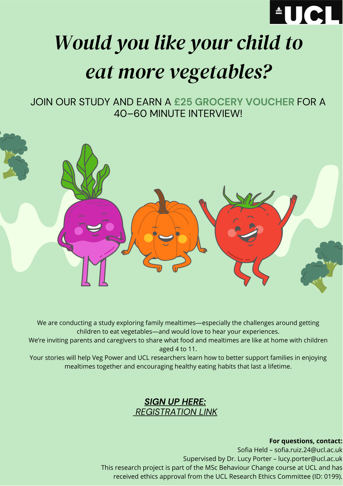
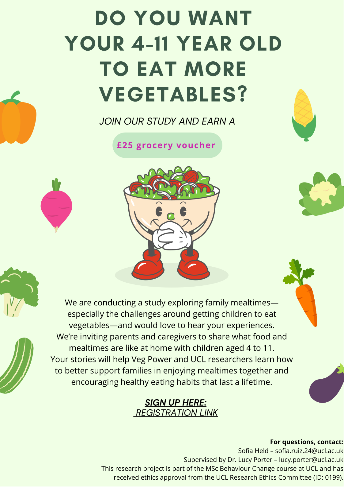

# A Behavioural Analysis for Increasing Vegetable Consumption of Children in the UK (Master's Thesis)

## Overview
This qualitative study explores how distributed teams coordinate and maintain engagement when working remotely. Conducted for a consulting engagement with Company X in Spring 2024.

## Background & Objectives
- **Context**: Rising trend of hybrid work prompted Company X to understand challenges in remote collaboration.
- **Objective**: Identify communication pain points and propose behavioural interventions to improve engagement and productivity.

## Methods
- **Design**: Semi-structured interviews with 20 team members across departments.
- **Data Collection**: Interviews conducted via video call, recorded with consent, transcribed and anonymized.
- **Analysis**: Thematic analysis using NVivo; coding framework developed iteratively.
- **Ethics**: Participants provided informed consent; transcripts stored securely; identifiable data removed.

## Key Findings
1. **Over-communication Fatigue**: Many participants felt overwhelmed by constant messaging.
2. **Lack of Rituals**: Absence of informal “watercooler” interactions decreased sense of team cohesion.

## Veg Power Project Visuals

  <button class="vegp-arrow vegp-arrow-left" aria-label="Previous image">&#9664;</button>
  
  

    
    
  

  
  <button class="vegp-arrow vegp-arrow-right" aria-label="Next image">&#9654;</button>

## Recommendations & Impact
- **Structured Communication Windows**: Suggest “focus hours” with minimal notifications; pilot with Team A resulted in a 15% self-reported increase in concentration.  
- **Virtual Social Rituals**: Weekly “coffee chat” sessions; feedback indicated improved team cohesion.  
- **Boundary Guidelines**: Developed guidelines for after-hours messaging; adopted by leadership.

<!-- A full report is available: [Download PDF](../assets/remote-collab-report.pdf) -->

## Reflections & Next Steps
- Broader rollout and measurement of longer-term outcomes.
- Potential follow-up quantitative survey to measure impact across the organization.